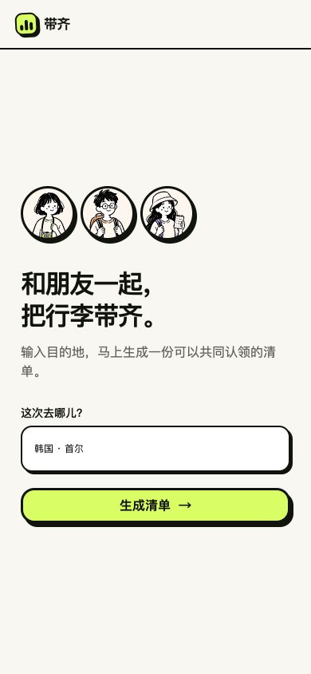
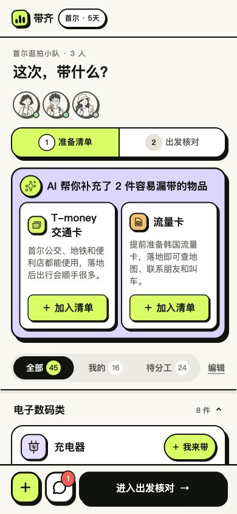
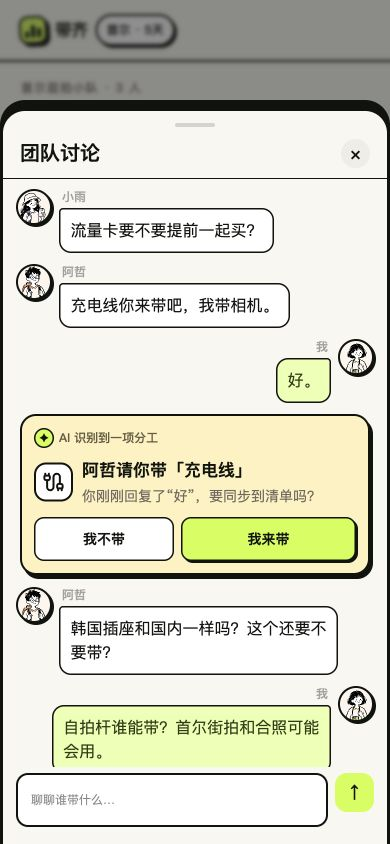
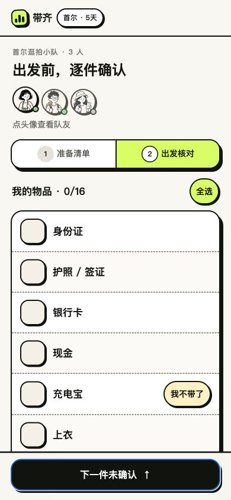
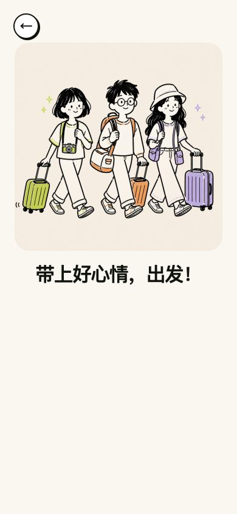
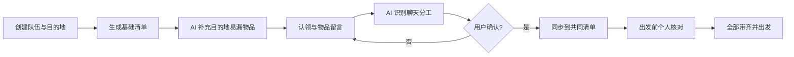

# 带齐 DaiQi

> 面向 2–4 人结伴旅行的 AI 行李协作助手：一起分工，出发前逐件核对，这次别漏带。

“带齐”不做路线攻略，而是聚焦旅行中最容易被忽略、却高频发生的一件事：**朋友之间到底谁带什么，出门前是否真的装进了包里。**

当前版本以“韩国 · 首尔，3 人同行”为演示场景，完整覆盖创建队伍、AI 补充物品、多人认领、物品留言、AI 聊天分工确认、个人出发核对与完成出发。

> 在线 Demo：<https://daiqi-packlist.xuchenyu020412.chatgpt.site/>（当前为私有演示站点，公开展示可使用下方截图）

## Demo

<table>
  <tr>
    <td align="center"><br/><b>创建旅行队伍</b></td>
    <td align="center"><br/><b>共同准备清单</b></td>
    <td align="center"><br/><b>AI 聊天分工确认</b></td>
  </tr>
  <tr>
    <td align="center"><br/><b>出发前个人核对</b></td>
    <td align="center"><br/><b>准备就绪</b></td>
    <td></td>
  </tr>
</table>

## 为什么做这个产品

朋友一起旅行时，共享表格虽然能记录物品，却有三个明显问题：

1. 表格适合录入，不适合手机上的高频点击和核对。
2. “谁来带”往往散落在微信群聊里，讨论结果不会自动回到清单。
3. 准备阶段关注团队分工，临出发时只想看“我自己还要带什么”，两个任务需要不同界面。

带齐把这个过程拆成两个清晰阶段：

- **准备清单**：看全队物品、认领、共同携带、留言和调整清单。
- **出发核对**：只核对自己要带的物品，逐件打勾后出发。

## 核心亮点

### 1. AI 只补“清单缺口”

AI 根据目的地与当前清单，最多推荐 2 件容易忽略且尚未出现的物品。它不会生成冗长旅游攻略，也不会重复已有物品。首尔 Demo 中推荐 T-money 交通卡和流量卡。

### 2. 从聊天自然语言到结构化分工

当阿哲说“转换插头你来带吧”，用户回复“好”，AI 会在这条回复下立即生成一张分工确认卡。只有用户点击“我来带”后，清单才会更新，避免模型误判直接修改协作数据。

### 3. 同一份清单，两种任务视图

准备时保留“全部 / 我的 / 待分工”，出发前则切换为个人核对清单。团队协作和个人执行不混在同一套按钮里，降低临出发时的操作负担。

### 4. 支持重复携带，而不是强制唯一负责人

公共物品允许多人同时选择携带。例如小雨已经带耳机，其他人仍可选择“我也带”。个人证件、衣物等则默认每人自备。

### 5. 轻量但完整的协作闭环

物品可以被新增、删除、拖动排序；点击物品会打开带独立阴影的居中留言弹窗，按时间展示每个人的留言，并可直接认领或释放；核对时发现带不了，可将团队物品退回待分工池。

## 产品流程



## 当前实现状态

| 能力 | 状态 | 说明 |
|---|---|---|
| 手机端完整交互 Demo | 已实现 | 创建、认领、留言、聊天、编辑、核对、出发均可操作 |
| AI 目的地物品推荐 | 已实现 | 服务端 API、结构化输出、去重、最多 2 条、失败回退 |
| AI 聊天分工识别 | 原型实现 | 当前为前端规则识别与确认卡，尚未接入大模型服务 |
| 数据库持久化 | 未接入 | Drizzle/D1 脚手架存在，但 schema 为空，刷新后恢复演示数据 |
| 真实账号与队伍邀请 | 未接入 | 已有 ChatGPT 身份读取工具，但页面尚未绑定用户数据 |
| 多人实时同步与在线状态 | 未接入 | 当前头像与在线状态为演示数据 |
| 推送提醒 | 交互原型 | 有提醒入口，未接系统通知服务 |

完整说明见：

- [产品案例与 PRD](docs/PRODUCT_CASE_STUDY.md)
- [AI、后端与数据库方案](docs/AI_AND_BACKEND_DESIGN.md)
- [个人中心与个性化清单策略 PRD](docs/PERSONAL_CENTER_PRD.md)

## 技术栈

- React 19 + TypeScript
- vinext / Vite
- Cloudflare Workers / Sites
- OpenAI Responses API（AI 物品推荐）
- Drizzle ORM + Cloudflare D1（已预留，尚未启用）
- Phosphor Icons + Lucide Icons
- Node Test Runner

## 本地运行

要求 Node.js `>=22.13.0`。

```bash
npm install
cp .env.example .env.local
npm run dev
```

打开 <http://localhost:3000/>。

`OPENAI_API_KEY` 为可选配置：不配置时会使用内置的目的地安全回退建议，仍可完整体验产品流程。

```bash
npm run build
npm test
```

## 项目结构

```text
app/
  page.tsx                    # 核心产品流程与交互原型
  api/suggestions/route.ts   # AI 目的地物品推荐接口
  typography.css             # 语义化字体 Token
db/
  schema.ts                  # D1/Drizzle 数据模型入口（待建设）
docs/
  PRODUCT_CASE_STUDY.md      # 产品定位、用户流程与指标
  AI_AND_BACKEND_DESIGN.md   # AI 链路、数据库和生产架构
  PERSONAL_CENTER_PRD.md     # 个人中心、个性化规则、接口与验收标准
  assets/                    # GitHub Demo 截图
tests/
  rendered-html.test.mjs     # 构建与关键产品规则回归测试
```

## 项目阶段

当前定位为 **AI 产品岗位作品集级高保真原型**。前端关键流程与第一个 AI 服务已可运行；真实多人协作需要继续完成数据库、鉴权、实时同步和消息通知。文档中提供了可直接进入开发排期的下一阶段方案。
