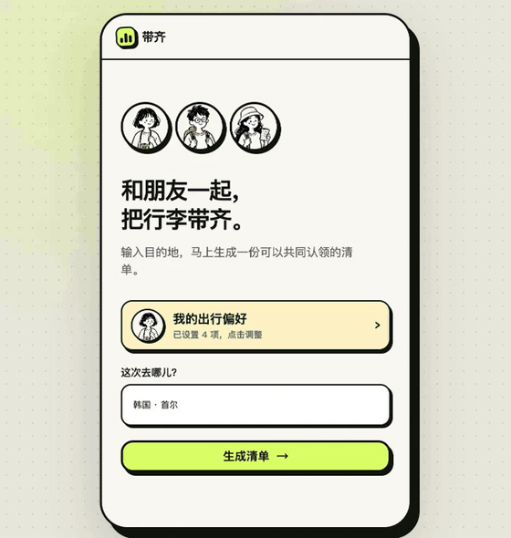
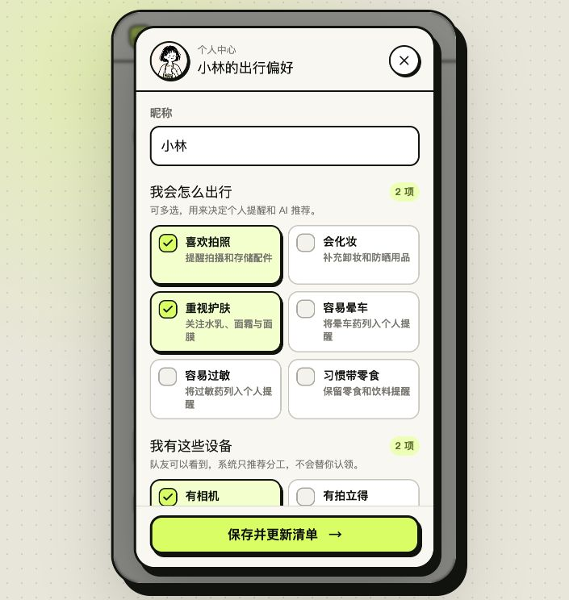
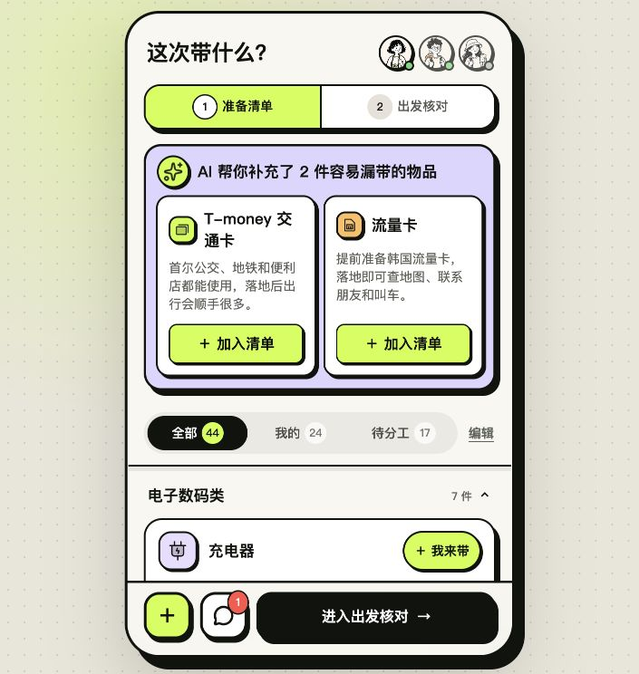
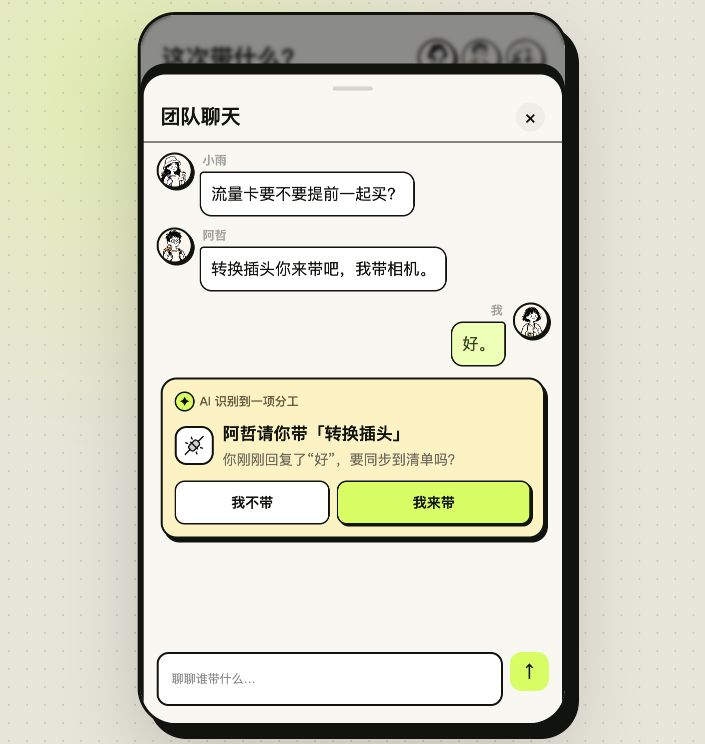
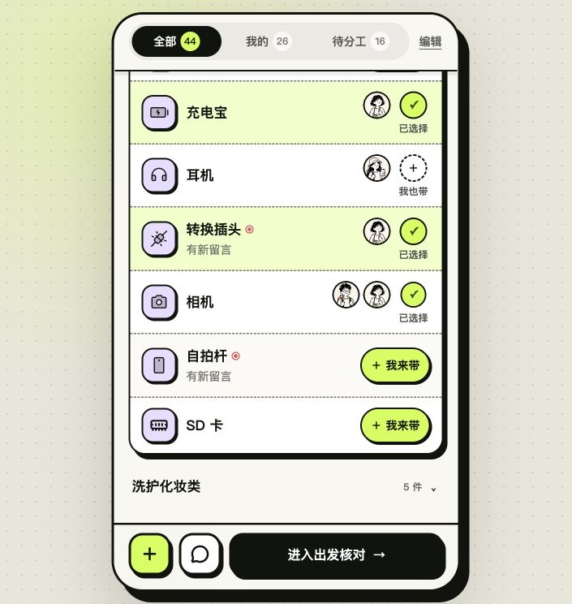
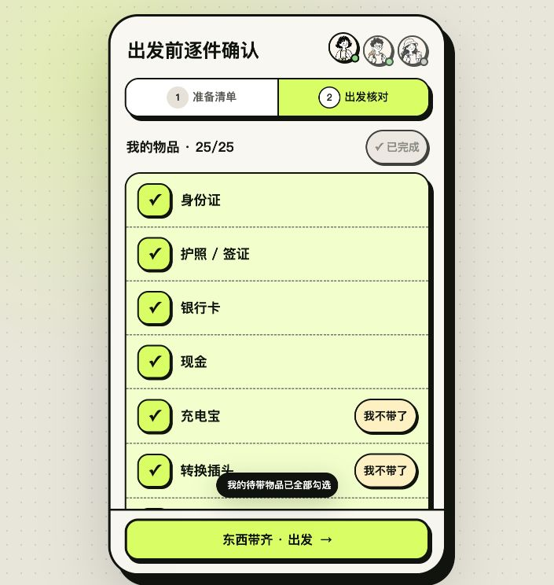
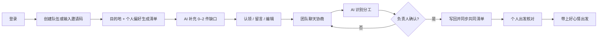
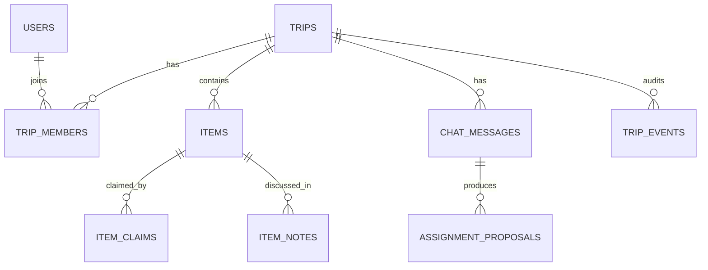

# 带齐 DaiQi

### 2–4 人朋友一起用的 AI 旅行物品协作 App

> 不做路线、酒店和景点攻略，只解决一件事：**一起出门时，谁带什么，出发前是否真的带齐。**

**可安装 PWA · 真实账号 · 邀请码组队 · D1 数据库 · 多人同步 · DeepSeek AI**

<p align="center">
  
</p>

<p align="center">
  <a href="https://daiqi-packlist.xuchenyu020412.chatgpt.site/"><b>线上部署</b></a>
  ·
  <a href="docs/assets/daiqi-demo.mp4">10 秒 Demo</a>
  ·
  <a href="docs/PRODUCT_CASE_STUDY.md">产品案例 / PRD</a>
  ·
  <a href="docs/AI_AND_BACKEND_DESIGN.md">AI 与后端方案</a>
</p>

当前版本已经从高保真原型升级为可运行的多人协作 MVP：用户可以登录、创建或加入队伍、保存共同清单、与朋友近实时协作，并在两个关键节点调用 AI。默认用「韩国 · 首尔，3 人同行」展示完整产品闭环。

## 为什么做这个产品

朋友出行前常用共享表格列物品、再去群聊讨论分工。信息被拆在两个地方，最终会出现三个问题：

- 清单不完整：用户不知道自己漏想了什么；
- 责任不清楚：讨论过，但没有沉淀为“谁来带”；
- 临出发难核对：团队清单很长，个人只想确认自己负责的东西。

带齐把这条流程收进一个 App：

| | 说明 |
|---|---|
| 目标用户 | 2–4 人朋友结伴旅行 |
| 核心链路 | 创建队伍 → 生成清单 → AI 补漏 → 团队分工 → 个人核对 → 出发 |
| 产品边界 | 不做旅游攻略，只做物品准备与协作 |
| 北极星指标 | 出发前完成个人待带清单核对的旅行占比 |

## 3 个核心亮点

### 01｜规则先预设，AI 只补清单缺口

系统先用可解释规则生成基础清单，再根据用户特征做个性化：

- 旅行共性偏好：想出片、会化妆、重视护肤；
- 身体情况：容易晕车、容易过敏、容易低血糖，仅用于个人清单；
- 已有设备：相机、拍立得、自拍杆，用于预设相关物品，不替用户认领；
- 目的地条件：如境外旅行才预设转换插头，户外、观星等偶发活动由目的地和具体行程触发。

规则生成完成后，DeepSeek 只返回清单里没有、且容易忽略的 **0–2 件物品**。建议支持加入和移出；没有可靠缺口时，AI 卡片自动消失。

<table>
  <tr>
    <td align="center" width="50%"><br/><sub>少量高价值问题完成个性化，不把注册做成长问卷</sub></td>
    <td align="center" width="50%"><br/><sub>首尔案例只补充 T-money 交通卡与流量卡</sub></td>
  </tr>
</table>

**AI 产品判断：** 推荐不是越多越好。对高频操作型产品，AI 应该减少搜索与思考，而不是把一整段聊天答案搬进界面。

### 02｜把聊天里的“好”，变成可确认的分工

团队聊天用于自然协商。例如队友说“充电器你来带吧”，用户回复“好”，服务端会识别：

- 物品：充电器；
- 发起人和负责人；
- 意图：请求、认领或取消；
- 置信度与证据消息。

识别结果立即显示在对应消息后。只有负责人点击“我来带”后才会写回共同清单；拒绝、反悔、多人多物品和低置信度场景都有独立处理，不会让模型静默改数据。

<p align="center">
  
</p>

**AI 产品判断：** 这是 Human-in-the-loop。AI 负责理解非结构化对话，用户保留最终决定权，兼顾效率、准确性与责任可追溯。

### 03｜团队分工一眼可见，出发时只核对自己

准备阶段的团队清单覆盖四种真实协作状态：

- 无人认领；
- 只有我认领；
- 只有队友认领；
- 我和队友都带同一件物品。

物品可以多人同时携带；点击物品可查看带时间顺序的独立留言。团队聊天与物品留言分开：前者用于跨物品协商和 AI 分工识别，后者像共享文档批注一样绑定具体物品，不依赖 AI 才能展示。

出发核对页只保留“我需要带的东西”，用户只能勾选自己的物品，也可以一键全选，或将临时带不了的团队物品退回待分工池。

<table>
  <tr>
    <td align="center" width="50%"><br/><sub>团队视图：无人认领、单人认领、共同携带都能直接看懂</sub></td>
    <td align="center" width="50%"><br/><sub>个人视图：只核对自己真正要带的物品</sub></td>
  </tr>
</table>

## 完整产品流程



## 两项 AI 能力如何落地

| AI 能力 | 输入 | 结构化输出 | 产品护栏 | 核心指标 |
|---|---|---|---|---|
| 目的地物品补漏 | 目的地、天数、已有清单、出行偏好 | 0–2 个物品、分类和一句理由 | 同义词去重、排除已有项、最多 2 条、无建议即隐藏、失败规则回退 | 采纳率、移出率、重复率、响应时延 |
| 聊天分工识别 | 最近消息、成员、当前物品状态 | 物品、发起人、负责人、意图、置信度、证据消息 | 低置信度不弹卡、最新表达优先、负责人确认后写入、幂等去重 | 确认率、误触发率、纠正率、写入成功率 |

两个能力都由服务端调用 DeepSeek Chat Completions，并使用 JSON Object 输出约束与服务端字段校验。密钥只保存在托管平台的加密环境变量中，不进入浏览器、仓库或构建产物；模型异常时使用确定性规则回退，主流程仍可继续。

## 多人协作、数据与权限

这不是只保存在浏览器里的演示数据。当前版本已完成真实服务端链路：

- 托管账号身份与用户资料；
- 6 位邀请码建队 / 加队，面向 2–4 人协作、成员上限 4 人；
- Cloudflare D1 + Drizzle，共 11 张业务表；
- 物品、认领、留言、聊天、核对状态、AI 候选和事件日志持久化；
- 客户端修改后 450ms 合并保存，每 2.5 秒按版本增量轮询；
- 乐观锁防止覆盖更新，冲突时刷新并提示；
- 非队员不能读取队伍，消息作者由服务端账号绑定；
- 每个人只能确认或取消自己的携带状态，不能替朋友核对。

核心数据关系：



## 当前完成度

| 能力 | 状态 | 当前实现 |
|---|---|---|
| 手机安装 | ✅ | PWA，可添加到 iPhone / Android 主屏幕并独立全屏启动 |
| 账号与组队 | ✅ | 托管账号登录、创建队伍、6 位邀请码、成员权限与 4 人上限 |
| 共同清单 | ✅ | 认领、多人同带、留言、筛选、增删、排序、分类、撤回删除 |
| 个性化清单 | ✅ | 基础规则 + 旅行偏好 + 身体情况 + 已有设备 + 目的地条件 |
| AI 目的地补漏 | ✅ | DeepSeek 服务端调用、去重、最多 2 条、可移出与失败回退 |
| AI 聊天分工 | ✅ | 结构化抽取、即时确认卡、反悔处理、用户确认后写入 |
| 出发核对 | ✅ | 只显示自己的待带物品、逐件确认、一键全选、退回待分工 |
| 数据库 | ✅ | Cloudflare D1 + Drizzle，11 张业务表和迁移脚本 |
| 多人同步 | ✅ | 450ms 合并保存、2.5 秒增量轮询、在线心跳、版本乐观锁 |
| 质量验证 | ✅ | ESLint、TypeScript、生产构建和 22 项自动化回归测试 |

## 主要接口

| 方法 | 接口 | 作用 |
|---|---|---|
| GET | `/api/session` | 当前账号与已加入队伍 |
| GET / PUT | `/api/profile` | 读取和保存出行偏好 |
| GET / POST | `/api/trips` | 获取队伍或创建新队伍 |
| POST | `/api/trips/join` | 使用邀请码加入队伍 |
| GET / PUT | `/api/trips/:tripId/state` | 增量读取与乐观锁保存共同状态 |
| POST | `/api/suggestions` | 生成目的地物品补漏建议 |
| POST | `/api/trips/:tripId/intent` | 从聊天中识别分工候选 |

## 产品与技术文档

- [产品案例与 PRD](docs/PRODUCT_CASE_STUDY.md)：定位、用户旅程、交互规则、指标与迭代思路
- [AI、后端与数据库方案](docs/AI_AND_BACKEND_DESIGN.md)：Prompt、结构化输出、数据模型、同步、权限和异常处理
- [个人中心与个性化策略 PRD](docs/PERSONAL_CENTER_PRD.md)：偏好采集、规则矩阵、接口与验收标准

## 技术栈

- React 19 + TypeScript
- vinext / Vite
- Cloudflare Workers / Sites
- DeepSeek Chat Completions（两个服务端 AI 能力）
- Drizzle ORM + Cloudflare D1
- Phosphor Icons + Lucide Icons
- Node Test Runner

## 本地运行

要求 Node.js `>=22.13.0`。

```bash
npm install
cp .env.example .env.local
npm run dev
```

打开 <http://localhost:3000/>。不配置模型密钥时会使用安全的规则回退；如需调用真实模型，只在服务端环境中配置 `DEEPSEEK_API_KEY`，不要提交 `.env.local`。

```bash
npm run lint
npx tsc --noEmit
npm test
npm run build
```

## 项目结构

```text
app/
  page.tsx                    # 完整移动端产品流程与多人同步客户端
  api/session/               # 账号、个人资料与队伍列表
  api/profile/               # 出行偏好服务端持久化
  api/trips/                 # 建队、邀请码、状态同步与聊天分工识别
  api/suggestions/route.ts   # DeepSeek 目的地物品补漏
  typography.css             # 语义化 Typography Token
db/
  schema.ts                  # D1 / Drizzle 的 11 张业务表
drizzle/
  0000_stormy_darkhawk.sql   # 数据库迁移
lib/
  chat-intent.ts             # 聊天分工规则回退与模型输出校验
docs/
  PRODUCT_CASE_STUDY.md      # 产品定位、用户流程与指标
  AI_AND_BACKEND_DESIGN.md   # AI 链路、数据库、权限和异常处理
  PERSONAL_CENTER_PRD.md     # 个人中心、个性化规则和验收标准
  assets/                    # GitHub Demo 动图、视频与截图
tests/
  rendered-html.test.mjs     # 构建与关键产品规则回归测试
```

---

这是一个面向 AI 产品经理作品集的真实 MVP：**AI 不替用户做主，而是把“清单补漏”和“聊天分工”嵌入可确认、可追踪、可多人协作的业务闭环。**
