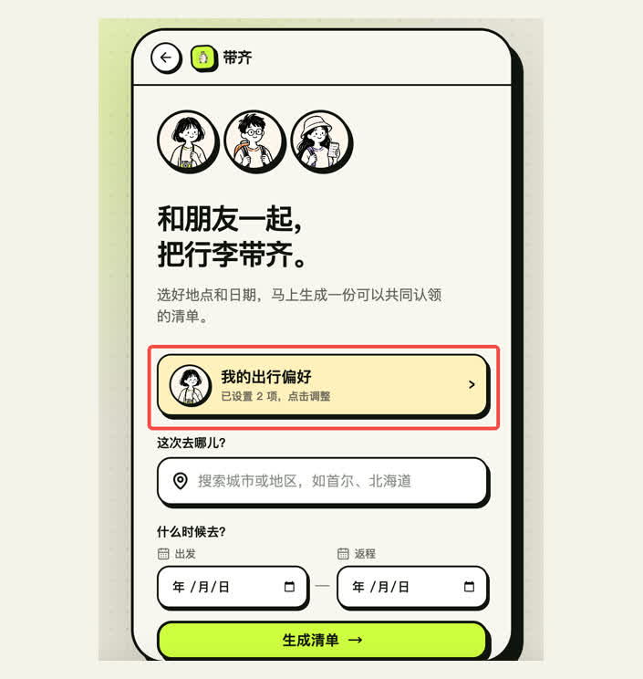
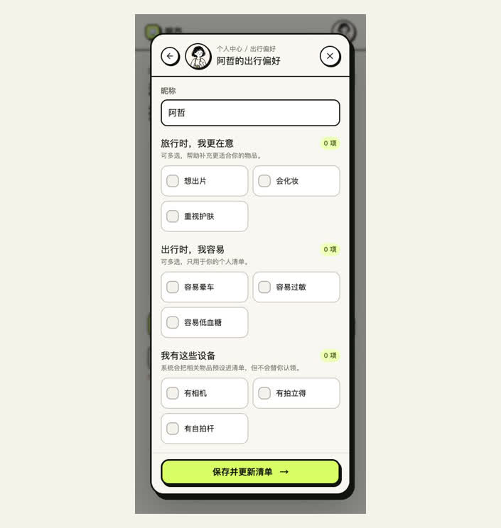
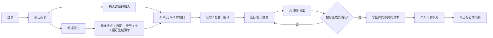
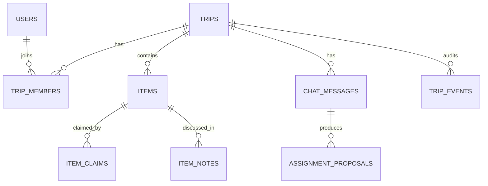

# 带齐 DaiQi

### 2–4 人朋友一起用的 AI 旅行物品协作 App

> 把群聊里容易遗忘和误解的携带约定，变成队友可见、本人确认、出发前可核对的协作状态。

**可安装 PWA · 真实账号 · 邀请码组队 · D1 数据库 · 多人同步 · DeepSeek AI**

<table>
  <tr>
    <td align="center" valign="top" width="50%"><br/><b>01 创建旅行队伍</b><br/><sub>选择目的地与日期，邀请同行成员加入</sub></td>
    <td align="center" valign="top" width="50%"><br/><b>02 AI 补充物品</b><br/><sub>结合行程与偏好，从现有清单之外推荐 Top 2</sub></td>
  </tr>
  <tr>
    <td align="center" valign="top" width="50%"><br/><b>03 多人协作认领</b><br/><sub>同一物品支持无人、单人或多人携带</sub></td>
    <td align="center" valign="top" width="50%"><br/><b>04 AI 识别聊天分工</b><br/><sub>识别口头约定，由被指派成员确认写入</sub></td>
  </tr>
</table>

<p align="center">
  <a href="https://daiqi-packlist.xuchenyu020412.chatgpt.site/"><b>线上部署</b></a>
  ·
  <a href="docs/assets/daiqi-demo.mp4">10 秒 Demo</a>
  ·
  <a href="docs/PRODUCT_CASE_STUDY.md">产品案例 / PRD</a>
  ·
  <a href="docs/AI_AND_BACKEND_DESIGN.md">AI 与后端方案</a>
</p>

当前版本是可运行的多人协作 MVP：用户可以登录、通过邀请码组队、共同认领物品、留言和聊天，并在出发前只核对自己需要携带的内容。AI 被放在两个明确节点：补充清单缺口，以及把聊天中的口头约定转成待确认分工。

## 为什么做这个产品

2–4 人结伴出行时，洗面奶、防晒、雨伞、充电宝等物品既可以各自携带，也可以根据队友的准备情况减少重复。难点不只是“记住要带什么”，而是每个人的决定都依赖队友：A 以为 B 会带，B 也以为 A 会带；或者 B 看到 A 已认领便决定不带，但 A 后来改变计划却没有及时同步。

现有工具没有把这种相互依赖的决策保存下来：

- **群聊适合讨论，却不保存最新状态。** “你带相机吧”“好”很快被后续消息淹没，反悔后的旧结论仍留在聊天记录里。
- **共享表格可以记录，却不适合手机上的高频操作。** 缩放、横向查看和编辑单元格增加了认领、修改与临行核对的成本。
- **个人备忘录只能提醒自己。** 它看不到队友的携带选择，也无法判断一件团队物品究竟无人携带、单人携带还是多人都带。

因此，带齐连接三个连续状态：**团队需要什么、当前谁决定携带、出发前本人是否已经装好**。产品不强制消除所有重复，而是让无人认领、单人认领、多人同带和个人自备一眼可见，使每个人能够基于同一份最新状态作出自己的携带决定。

| | 说明 |
|---|---|
| 目标用户 | 2–4 人朋友结伴旅行 |
| 核心链路 | 创建队伍 → 共同认领与协商 → 对应成员确认分工 → 个人核对 → 出发 |
| 核心价值 | 让队友的携带选择可见、口头约定可追踪、个人任务可核对 |
| 产品边界 | 不做旅游攻略，只做物品准备与协作 |
| 北极星指标 | 出发前完成个人待带清单核对的旅行占比 |

## 3 个核心亮点

### 01｜让队友的携带选择成为共同状态

洗面奶、雨伞、防晒等物品并不是固定的“公共物品”或“私人物品”：有人希望自己带，有人会根据队友是否携带再决定。准备清单因此覆盖四种真实状态：

- 无人认领；
- 只有我认领；
- 只有队友认领；
- 我和队友都带同一件物品。

一件物品可以被多人同时认领，后选择的人不会覆盖已有成员。头像并排展示每位携带者，使成员可以直接判断“已经有人带了，我是否还需要带”。证件、衣物等个人自备物品则自动进入每个人自己的核对清单，但队友仍能看到其类别与准备进度。

准备阶段处理团队决策，出发核对阶段只展示“个人自备 + 我已认领”的物品。用户只能勾选自己的任务，也可以把临时带不了的团队物品退回待分工池。

<table>
  <tr>
    <td align="center" width="50%"><br/><sub>团队视图：队友的携带选择直接可见</sub></td>
    <td align="center" width="50%"><br/><sub>个人视图：只核对自己真正要带的物品</sub></td>
  </tr>
</table>

### 02｜把聊天里的“好”，变成本人确认的分工

团队聊天用于自然协商。例如队友说“充电器你来带吧”，用户回复“好”，服务端会识别：

- 物品：充电器；
- 发起人和被指派成员；
- 意图：请求、认领或取消；
- 置信度与证据消息。

识别结果立即显示在对应消息后。聊天中的“好 / 行 / 可以”只触发待确认卡；只有对应成员本人点击“我来带”后才会写回共同清单。任何成员也可以直接手动认领；AI 不设置队长审批，也不会替其他成员作出承诺。拒绝、反悔、多物品和低置信度场景均有独立处理。

<p align="center">
  
</p>

**AI 产品判断：** AI 负责理解非结构化对话并提出候选动作，承担任务的成员保留最终决定权。共享状态的修改可确认、可拒绝、可追溯。

### 03｜规则生成基础清单，AI 只补当前缺口

系统先用可解释规则生成基础清单，再结合旅行共性偏好、身体情况、已有设备和当次行程条件做个性化。地点组件返回标准城市与坐标，日期用于匹配天气；境外旅行才考虑当地交通卡、流量卡和转换插头，境内目的地明确排除境外物品。

DeepSeek 返回候选物品后，服务端继续完成名称标准化、已有清单去重、境内外过滤和优先级排序，最终只展示 **Top 2 清单缺口**。用户主动点击后才加入统一物品池；没有可靠缺口时，模块展示“基础清单已覆盖主要需求”，而不是留下空白。

<table>
  <tr>
    <td align="center" width="50%"><br/><sub>用少量高价值问题完成个性化</sub></td>
    <td align="center" width="50%"><br/><sub>AI 只展示 2 个尚未覆盖的清单缺口</sub></td>
  </tr>
</table>

**AI 产品判断：** 推荐不是越多越好。AI 的价值是补充规则与共同清单没有覆盖的少量信息，而不是重新生成一份长清单。

## 完整产品流程



## 两项 AI 能力如何落地

| AI 能力 | 输入 | 结构化输出 | 产品护栏 | 核心指标 |
|---|---|---|---|---|
| 目的地物品补漏 | 标准地点、日期、天气、已有清单、出行偏好 | 0–2 个物品、分类和一句理由 | 可靠预报窗口外改用季节信息、同义词去重、排除已有项、最多 2 条、失败规则回退 | 采纳率、移出率、重复率、响应时延 |
| 聊天分工识别 | 最近消息、成员、当前物品状态 | 物品、发起人、被指派成员、意图、置信度、证据消息 | 低置信度不弹卡、最新表达优先、被指派成员确认后写入、幂等去重 | 确认率、误触发率、纠正率、写入成功率 |

两个能力都由服务端调用 DeepSeek Chat Completions，并使用 JSON Object 输出约束与服务端字段校验。密钥只保存在托管平台的加密环境变量中，不进入浏览器、仓库或构建产物；模型异常时使用确定性规则回退，主流程仍可继续。

## 多人协作、数据与权限

这不是只保存在浏览器里的演示数据。当前版本已完成真实服务端链路：

- 托管账号身份与用户资料；
- 6 位邀请码建队 / 加队，面向 2–4 人协作、成员上限 4 人；
- Cloudflare D1 + Drizzle，共 11 张业务表；
- 物品、认领、留言、聊天、核对状态、AI 候选和事件日志持久化；
- 客户端修改后 450ms 合并保存；服务端通过 WebSocket 推送轻量队伍变更通知，并以约 1 秒 D1 版本监听覆盖不同 Worker 实例；客户端收到后立即拉取最新快照；
- 每 2.5 秒的版本增量轮询作为断线重连和跨实例兜底，D1 始终是权威数据源；
- 乐观锁防止覆盖更新，冲突时刷新并提示；
- 非队员不能读取队伍，消息作者由服务端账号绑定；
- 每个人只能确认或取消自己的携带状态，不能替朋友核对。

核心数据关系：



## 当前完成度

| 能力 | 状态 | 当前实现 |
|---|---|---|
| 手机安装 | ✅ | PWA，可添加到 iPhone / Android 主屏幕并独立全屏启动 |
| 账号与组队 | ✅ | 托管账号登录、创建队伍、6 位邀请码、成员权限与 4 人上限 |
| 共同清单 | ✅ | 认领、多人同带、留言、筛选、增删、排序、分类、撤回删除 |
| 个性化清单 | ✅ | 基础规则 + 旅行偏好 + 身体情况 + 已有设备 + 目的地条件 |
| AI 目的地补漏 | ✅ | DeepSeek 服务端调用、去重、最多 2 条、可移出与失败回退 |
| AI 聊天分工 | ✅ | 结构化抽取、即时确认卡、反悔处理、用户确认后写入 |
| 出发核对 | ✅ | 只显示自己的待带物品、逐件确认、一键全选、退回待分工 |
| 数据库 | ✅ | Cloudflare D1 + Drizzle，11 张业务表和迁移脚本 |
| 多人同步 | ✅ | WebSocket 变更推送、自动重连、2.5 秒轮询兜底、在线心跳、版本乐观锁 |

## 主要接口

| 方法 | 接口 | 作用 |
|---|---|---|
| GET | `/api/session` | 当前账号与已加入队伍 |
| GET / PUT | `/api/profile` | 读取和保存出行偏好 |
| GET | `/api/places` | 搜索并标准化城市或地区 |
| POST | `/api/weather` | 生成清单时后台获取天气，作为 AI 补漏的隐藏上下文 |
| GET / POST | `/api/trips` | 获取队伍或创建新队伍 |
| POST | `/api/trips/join` | 使用邀请码加入队伍 |
| GET / PUT | `/api/trips/:tripId/state` | 增量读取与乐观锁保存共同状态 |
| GET (Upgrade) | `/api/trips/:tripId/events` | 升级为 WebSocket，接收队伍变更通知并处理 ping / pong 心跳 |
| POST | `/api/suggestions` | 生成目的地物品补漏建议 |
| POST | `/api/trips/:tripId/intent` | 从聊天中识别分工候选 |

## 产品与技术文档

- [产品案例与 PRD](docs/PRODUCT_CASE_STUDY.md)：定位、用户旅程、交互规则、指标与迭代思路
- [AI、后端与数据库方案](docs/AI_AND_BACKEND_DESIGN.md)：Prompt、结构化输出、数据模型、同步、权限和异常处理
- [个人中心与个性化策略 PRD](docs/PERSONAL_CENTER_PRD.md)：偏好采集、规则矩阵、接口与验收标准

## 技术栈

- React 19 + TypeScript
- vinext / Vite
- Cloudflare Workers / Sites
- DeepSeek Chat Completions（两个服务端 AI 能力）
- Drizzle ORM + Cloudflare D1
- Phosphor Icons + Lucide Icons
- Node Test Runner

## 本地运行

要求 Node.js `>=22.13.0`。

```bash
npm install
cp .env.example .env.local
npm run dev
```

打开 <http://localhost:3000/>。不配置模型密钥时会使用安全的规则回退；如需调用真实模型，只在服务端环境中配置 `DEEPSEEK_API_KEY`，不要提交 `.env.local`。

```bash
npm run lint
npx tsc --noEmit
npm test
npm run build
```

## 项目结构

```text
app/
  page.tsx                    # 完整移动端产品流程与多人同步客户端
  api/session/               # 账号、个人资料与队伍列表
  api/profile/               # 出行偏好服务端持久化
  api/trips/                 # 建队、邀请码、状态同步与聊天分工识别
  api/suggestions/route.ts   # DeepSeek 目的地物品补漏
  typography.css             # 语义化 Typography Token
db/
  schema.ts                  # D1 / Drizzle 的 11 张业务表
drizzle/
  0000_stormy_darkhawk.sql   # 数据库迁移
lib/
  chat-intent.ts             # 聊天分工规则回退与模型输出校验
docs/
  PRODUCT_CASE_STUDY.md      # 产品定位、用户流程与指标
  AI_AND_BACKEND_DESIGN.md   # AI 链路、数据库、权限和异常处理
  PERSONAL_CENTER_PRD.md     # 个人中心、个性化规则和验收标准
  assets/                    # GitHub Demo 动图、视频与截图
tests/
  rendered-html.test.mjs     # 构建与关键产品规则回归测试
```

---

这是一个面向 AI 产品经理作品集的多人协作 MVP：**先让队友的携带选择成为共同状态，再用 AI 补充清单缺口、理解聊天约定；AI 提出候选，对应成员本人作出承诺。**
