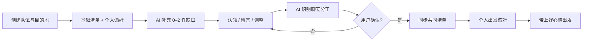

# 带齐 DaiQi

### 一个从「共享表格 + 群聊」痛点里长出来的 AI 旅行准备产品

> 不做旅行攻略，只解决一件事：**2–4 个朋友一起出门时，谁带什么，出发前是否真的带齐。**

<p align="center">
  
</p>

<p align="center">
  <a href="https://daiqi-packlist.xuchenyu020412.chatgpt.site/"><b>在线体验</b></a>
  ·
  <a href="docs/assets/daiqi-demo.mp4">10 秒 MP4 Demo</a>
  ·
  <a href="docs/PRODUCT_CASE_STUDY.md">产品案例</a>
  ·
  <a href="docs/AI_AND_BACKEND_DESIGN.md">AI / 后端方案</a>
</p>

当前以「韩国 · 首尔，3 人同行」为演示场景。个人项目覆盖：**用户洞察、产品策略、交互原型、AI 能力设计、前端实现与技术方案**。

## 30 秒看懂产品

| | 说明 |
|---|---|
| 目标用户 | 2–4 人朋友结伴旅行 |
| 核心问题 | 物品写在表格，分工聊在群里，临出发时仍不知道自己是否带齐 |
| 产品解法 | AI 补齐清单缺口，把聊天里的分工转成待确认任务，再生成每个人自己的核对清单 |
| 产品边界 | 不做路线、酒店和景点攻略；专注「准备物品 → 团队分工 → 出发核对」 |
| 北极星指标 | 出发前完成个人待带清单核对的旅行占比 |

## 3 个核心亮点

### 01｜AI 只补「清单缺口」，不制造信息负担

规则引擎先根据**目的地、用户偏好和已有设备**预设清单：例如摄影会补相机、备用电池、内存卡、充电宝与三脚架，户外、观星、运动、亲子、宠物等场景也有各自明确的物品映射；这些物品只进入清单，不会替用户认领。随后 AI 读取目的地、预设后的已有物品与出行偏好，只返回仍未覆盖、且容易忽略的 0–2 件物品。结构化输出、同义词去重与失败回退保证结果能直接进入产品流程；没有合适建议时，卡片会自动消失。

<table>
  <tr>
    <td align="center" width="50%"><br/><sub>偏好和设备用于预设相关物品；所有团队物品仍由用户主动认领</sub></td>
    <td align="center" width="50%"><br/><sub>首尔场景仅补充 T-money 交通卡与流量卡</sub></td>
  </tr>
</table>

**AI 产品判断：** 推荐不是越多越好。对高频操作型产品，AI 的价值是减少用户思考和搜索，而不是把聊天答案整段搬进界面。

### 02｜把聊天里的「好」，变成可确认的结构化分工

当队友说“转换插头你来带吧”，用户回复“好”，系统会立即识别出**物品、被指派人、意图与置信度**，在原消息下生成确认卡。只有用户点击“我来带”后才写回清单；拒绝、反悔或语义不确定都不会静默修改协作数据。

<p align="center">
  
</p>

**AI 产品判断：** 这是 Human-in-the-loop，而不是“AI 自动做主”。它保留群聊的自然表达，同时用一次确认解决模型误判、多人协作责任与结果可追溯问题。

> 当前 Demo 使用关键词与上下文规则复现交互闭环；生产方案计划接入大模型结构化抽取、置信度分层和幂等写入。详见 [AI / 后端方案](docs/AI_AND_BACKEND_DESIGN.md)。

### 03｜一眼看清团队分工，临出发只核对自己

准备阶段不是普通的个人清单，而是一张团队协作状态表：每件物品都能直接看出**无人认领、只有我认领、只有队友认领、我和队友共同携带**四种状态。临出发时界面再收敛为“我需要带的东西”，支持逐件打勾、一键全选，以及把临时带不了的团队物品退回待分工池。

<table>
  <tr>
    <td align="center" width="50%"><br/><sub>团队视图：待分工 / 我已带 / 队友已带 / 多人同带</sub></td>
    <td align="center" width="50%"><br/><sub>个人视图：只核对自己真正要带的物品</sub></td>
  </tr>
</table>

**产品判断：** 准备阶段的核心任务是“分工”，出发阶段的核心任务是“执行”。拆成两个视图，比在一张大表里继续叠按钮更符合用户当下目标。

## 关键产品流程



## AI 能力与评估思路

| AI 能力 | 输入 | 输出 | 关键护栏 | 核心指标 |
|---|---|---|---|---|
| 目的地补漏 | 目的地、天数、预设后的已有清单、出行偏好 | 0–2 个物品 + 一句话理由 | 结构化 Schema、同义词去重、最多 2 条、失败回退 | 建议采纳率、重复率、删除率、响应时延 |
| 聊天分工识别 | 最近对话、参与者、当前物品状态 | 物品、携带人、意图、置信度 | 低置信度不弹卡、用户确认后写入、幂等与审计 | 确认率、误触发率、人工纠正率、写入成功率 |

## 当前完成度

| 能力 | 状态 | 说明 |
|---|---|---|
| 手机安装与离线启动 | ✅ 已实现 | PWA，可添加到 iPhone / Android 主屏幕，支持独立全屏启动与本机清单续存 |
| 手机端完整交互 Demo | ✅ 已实现 | 创建、偏好、认领、留言、聊天、编辑、核对、出发均可操作 |
| AI 目的地物品推荐 | ✅ 已实现 | 服务端 API、结构化输出、去重、最多 2 条、失败回退；需配置 `OPENAI_API_KEY` 调用模型 |
| 个性化清单策略 | ✅ 已实现 | 偏好和已有设备补充预设物品，但不会自动分工 |
| AI 聊天分工识别 | 🧪 交互原型 | 当前规则识别；生产版大模型抽取方案已完成 |
| 数据库持久化 | 📝 已设计 | Drizzle / D1 脚手架存在，Schema 与迁移待接入 |
| 账号、队伍邀请与实时同步 | 📝 已设计 | 当前头像与在线状态为演示数据，生产架构见技术方案 |

我刻意保留这张完成度表：它区分了**可运行能力、交互原型和生产方案**，避免用高保真界面掩盖工程完成度。

## 产品文档

- [产品案例与 PRD](docs/PRODUCT_CASE_STUDY.md)：定位、用户旅程、交互规则、指标与迭代思路
- [AI、后端与数据库方案](docs/AI_AND_BACKEND_DESIGN.md)：Prompt、结构化输出、数据模型、实时协作与异常处理
- [个人中心与个性化策略 PRD](docs/PERSONAL_CENTER_PRD.md)：偏好采集、推荐矩阵、接口与验收标准

## 技术栈

- React 19 + TypeScript
- vinext / Vite
- Cloudflare Workers / Sites
- OpenAI Responses API（AI 物品推荐）
- Drizzle ORM + Cloudflare D1（已预留）
- Phosphor Icons + Lucide Icons
- Node Test Runner

## 本地运行

要求 Node.js `>=22.13.0`。

```bash
npm install
cp .env.example .env.local
npm run dev
```

打开 <http://localhost:3000/>。`OPENAI_API_KEY` 为可选配置；不配置时使用目的地安全回退建议，仍可完整体验产品流程。

```bash
npm run build
npm test
```

## 项目结构

```text
app/
  page.tsx                    # 核心产品流程与交互原型
  api/suggestions/route.ts   # AI 目的地物品推荐接口
  typography.css             # 语义化字体 Token
db/
  schema.ts                  # D1 / Drizzle 数据模型入口（待建设）
docs/
  PRODUCT_CASE_STUDY.md      # 产品定位、用户流程与指标
  AI_AND_BACKEND_DESIGN.md   # AI 链路、数据库和生产架构
  PERSONAL_CENTER_PRD.md     # 个人中心、个性化规则、接口与验收标准
  assets/                    # GitHub Demo 动图、视频与截图
tests/
  rendered-html.test.mjs     # 构建与关键产品规则回归测试
```

---

当前定位：**AI 产品经理作品集级高保真原型**。前端关键流程与第一个 AI 服务已可运行；真实多人协作需要继续完成数据库、鉴权、实时同步和消息通知。
