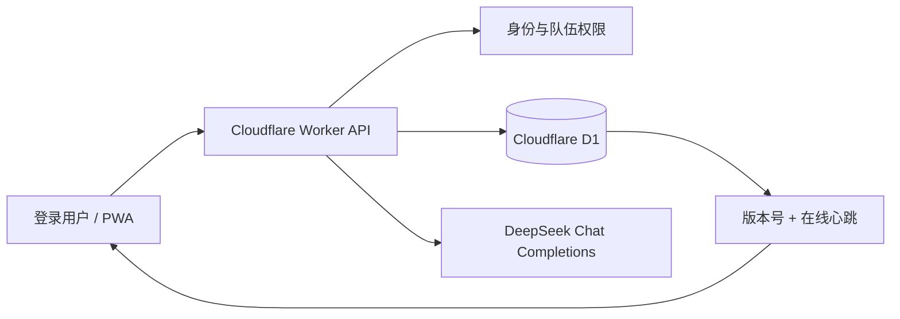

# 带齐｜AI、后端与多人协作设计（已实现）

## 1. 当前工程状态

“带齐”已从单机原型升级为带账号、数据库和多人同步的可运行 App。

| 模块 | 状态 | 实现 |
|---|---|---|
| 账号登录 | 已实现 | Sites / ChatGPT 登录身份；API 从可信转发头读取用户 |
| 队伍与邀请码 | 已实现 | 6 位邀请码，2–4 人，owner / member 权限 |
| 数据库 | 已实现 | Cloudflare D1 + Drizzle，11 张表和迁移 |
| 清单持久化 | 已实现 | 认领、删除、排序、留言、聊天和核对状态写服务端 |
| 多人同步 | 已实现 | 2.5 秒增量轮询、在线心跳、版本乐观锁和冲突提示 |
| 目的地 AI 补漏 | 已实现 | 服务端 DeepSeek API，最多 2 条、去重、校验和回退 |
| 聊天分工识别 | 已实现 | 服务端 DeepSeek 结构化抽取 + 本地规则回退 |
| PWA 安装 | 已实现 | iOS / Android 添加到主屏幕，WebP 资源预加载 |

R2 未启用，因为当前没有用户文件上传；避免为“看起来完整”引入无用基础设施。

## 2. 系统架构



客户端不保存模型密钥。`DEEPSEEK_API_KEY` 仅配置在托管平台的加密服务器环境变量中，仓库和浏览器产物均不包含密钥。

## 3. 数据库

迁移文件：`drizzle/0000_stormy_darkhawk.sql`。

| 表 | 用途 |
|---|---|
| `users` | 登录用户基础信息 |
| `profiles` | 昵称、兴趣偏好、已有设备 |
| `trips` | 队伍、目的地、邀请码、数据版本 |
| `trip_members` | 成员、角色、队内槽位、在线心跳 |
| `trip_items` | 物品、分类、排序和来源理由 |
| `item_owners` | 物品认领与个人核对状态；联合主键支持多人同带 |
| `item_notes` | 绑定具体物品的按时间留言 |
| `chat_messages` | 团队聊天消息 |
| `assignment_proposals` | AI 识别出的待确认分工 |
| `trip_snapshots` | 服务端权威快照和版本 |
| `trip_events` | 创建、加入和状态变更审计 |

快照保证移动端一次加载即可恢复完整页面；规范化表用于查询、审计和后续统计。每次保存同时更新两种表示。

## 4. 身份、权限与一致性

### 4.1 身份和队伍

- 未登录访问写接口返回 `401` 和登录路径。
- 创建者是 `owner`，朋友通过邀请码成为 `member`。
- 邀请码不存在返回 `404`；队伍达到 4 人返回 `409`。
- 每个队伍 API 都先校验 `trip_members`，非成员不能读取或修改。

### 4.2 成员级权限

- 用户只能勾选自己的出发核对状态，服务端会恢复其他成员原有值。
- 用户只能新增或取消自己的认领，不能伪造朋友已经认领。
- 新聊天和新留言的作者由服务端绑定为当前登录成员；客户端传入他人名字无效。
- 队内成员可以共同编辑清单物品、排序和分类，符合共享文档模型。

### 4.3 多人同步

客户端修改后 450ms 合并保存，服务端使用 `expectedVersion` 乐观锁：

1. 版本一致：保存，版本 `+1`，返回新快照。
2. 版本过期：返回 `409 + 最新快照`。
3. 客户端加载最新内容，并明确提示“朋友刚更新了清单，请重试刚才的操作”，不会静默覆盖。
4. 每 2.5 秒轮询；版本未变化时只返回成员在线状态，不重复传输整张清单。

这不是毫秒级 WebSocket，但对“收拾行李”低频协作足够实时，部署和故障复杂度更低。后续同时编辑频率上升后再升级 Durable Objects / WebSocket。

## 5. AI 功能一：目的地清单补漏

接口：`POST /api/suggestions`

### 输入与输出

```json
{
  "destination": "韩国 首尔",
  "startDate": "2026-08-28",
  "endDate": "2026-09-01",
  "weather": {
    "source": "forecast",
    "summary": "行程期间约 22–29°C，最高降水概率 70%"
  },
  "existingItems": ["身份证", "相机", "充电宝"],
  "preferences": ["想出片", "重视护肤"]
}
```

```json
{
  "suggestions": [{
    "name": "T-money 交通卡",
    "group": "证件与钱财类",
    "reason": "首尔公交、地铁和便利店都能使用。",
    "signal": "交通必备"
  }],
  "source": "model"
}
```

### 提示词与护栏

- 明确“不做路线和景点攻略”，只补物品缺口。
- 把标准地点、旅行日期、天气/季节信息、显式偏好和完整已有物品传给模型。
- 15 天可靠预报窗口外只传递当地月份与季节，不伪造远期逐日天气。
- 要求 JSON 对象、固定 7 类、最多 2 件；没有可靠建议可以返回 0 件。
- 服务端再次做长度、类别、重复、同义包含和数量校验。
- DeepSeek 不可用、超时或输出异常时使用目的地回退库。

### UI 状态

- 请求中：显示“正在检查清单”。
- 1–2 条：卡片可加入、移出和删除。
- 0 条：整个 AI 模块收起，避免空状态占据首屏。
- 加入后写入统一物品池，因此编辑、删除、认领、同步和出发核对无需特殊分支。

## 6. AI 功能二：聊天分工识别

接口：`POST /api/trips/:tripId/intent`

模型只接收最近 30 条消息、当前成员和当前物品名称，不发送邮箱等身份信息。

### 结构化输出

```json
{
  "assignments": [{
    "itemId": 7,
    "itemName": "充电器",
    "requester": "阿哲",
    "assignee": "我",
    "intent": "claim",
    "confidence": 0.96,
    "evidenceMessageIds": [101, 102]
  }],
  "source": "model"
}
```

`intent` 有三种：

- `claim`：负责人主动认领，或对他人的请求明确同意。
- `release`：负责人明确反悔、不再携带。
- `request`：只是提出“你来带”，目标尚未同意。

### 交互原则

- “A：你带充电器；B：好”会立即在 B 的“好”下面出现确认卡。
- 一句话涉及充电器和相机时返回两个独立候选，不漏掉第二件。
- B 明确说“我来带相机”或“我不带相机了”时同步自己的状态。
- `request` 不会直接替别人认领；等目标同意后才弹卡。
- AI 输出要经过物品白名单、成员白名单、置信度和去重校验。
- 模型失败时，规则回退仍处理明确认领、释放、请求 + 同意和多物品。

### 主要边界情况

| 情况 | 处理 |
|---|---|
| “谁带雨伞？” | 普通聊天，不输出分工 |
| “你带雨伞吧”但没有回复 | `request`，不改清单 |
| “好”对应最近一条多物品请求 | 每个物品一张确认卡 |
| “算了，我不带了” | `release`，以最新意图为准 |
| “相机我也带” | 新增本人，不覆盖已有携带者 |
| 物品不在清单 | 丢弃候选；后续可扩展“先添加物品”卡 |
| 目标不是当前用户 | 当前用户界面不展示替别人确认的卡 |
| 置信度 `<0.55` | 不打扰用户 |

## 7. API 清单

| 方法 | 路径 | 用途 |
|---|---|---|
| GET | `/api/session` | 当前账号与已加入队伍 |
| GET / PUT | `/api/profile` | 读取、保存个人偏好 |
| GET | `/api/places` | 搜索地点并返回标准名称、坐标与时区 |
| POST | `/api/weather` | 根据坐标和旅行日期返回逐日天气摘要或季节降级信息 |
| GET / POST | `/api/trips` | 队伍列表、创建队伍 |
| POST | `/api/trips/join` | 使用邀请码加入 |
| GET / PUT | `/api/trips/:tripId/state` | 获取、保存、同步完整协作状态 |
| POST | `/api/suggestions` | AI 目的地物品补漏 |
| POST | `/api/trips/:tripId/intent` | AI 聊天分工识别 |

## 8. 异常与降级

- 无数据库绑定：接口返回服务不可用，前端保留清晰错误，不伪装保存成功。
- 断网：页面保留当前内容并显示离线；恢复后待保存状态重试。
- AI 超时 / 额度问题：推荐和分工都使用规则回退，聊天与清单基础操作不阻塞。
- 数据冲突：返回最新快照并提示重试，不做 last-write-wins 静默覆盖。
- 非法输入：限制消息、物品、队伍名称和数组数量；服务端重新绑定作者与成员身份。

## 9. 测试与监控

自动化回归覆盖：数据库迁移完整性、登录保护、邀请码 4 人上限、成员权限、版本冲突、DeepSeek 密钥仅服务端、AI 结构字段、多物品规则、PWA 和关键 UI 流程。

上线后监控：AI 推荐成功率/回退率/采纳率/P95 延迟，分工卡确认率和拒绝率，状态保存失败率、`409` 冲突率、同步延迟、邀请码加入成功率与队伍平均成员数。
