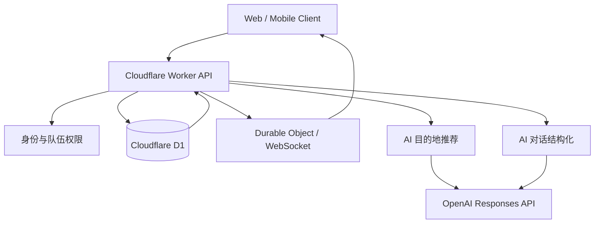
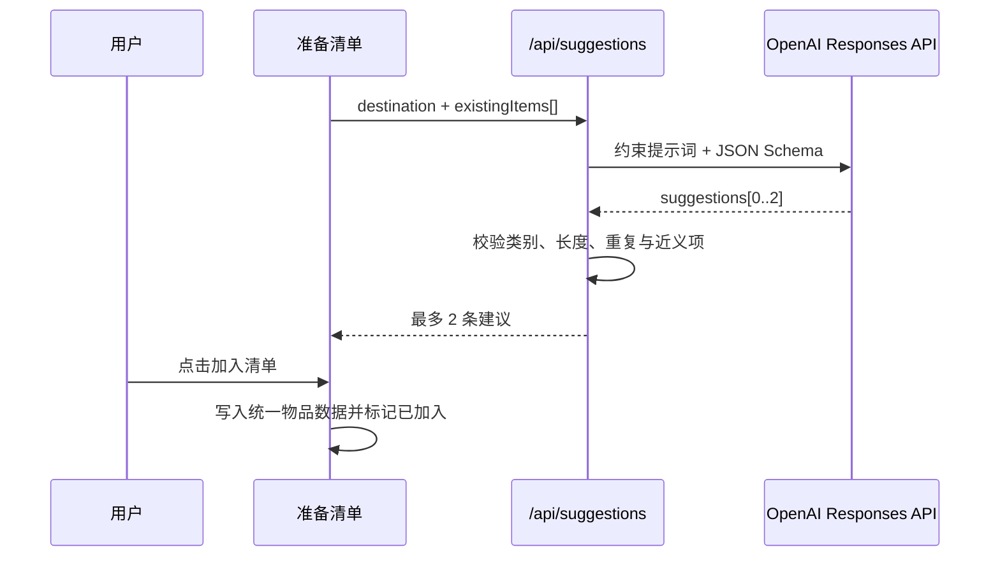
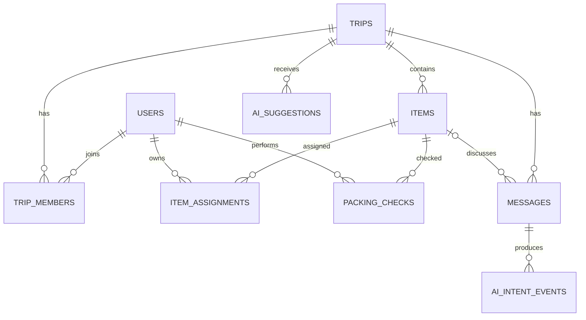

# 带齐：AI、后端与数据库设计

## 1. 先说结论：哪些已经做好

当前项目是一个可运行的高保真前端原型，并不是完整生产系统。

| 模块 | 当前状态 | 代码位置 / 事实 |
|---|---|---|
| 前端产品流程 | 已实现 | `app/page.tsx` |
| AI 物品推荐后端 | 已实现 | `POST /api/suggestions` |
| AI 推荐大模型调用 | 已实现但依赖密钥 | 使用 OpenAI Responses API；无密钥或异常时自动回退 |
| AI 聊天分工识别 | 规则原型 | 当前在前端用关键词、否定表达和上下文规则识别 |
| 服务端聊天识别模型 | 未实现 | 尚无独立 `/api/chat-intents` |
| 数据库 schema | 未实现 | `db/schema.ts` 为空 |
| Cloudflare D1 | 未绑定 | `.openai/hosting.json` 中 `d1` 为 `null` |
| 文件存储 R2 | 未绑定 | 当前产品无必要的文件上传场景 |
| 身份系统 | 工具已预留，业务未接入 | `app/chatgpt-auth.ts` 可读取身份，但页面未使用 |
| 多人实时同步 | 未实现 | 当前数据在 React 内存 state 中，刷新会重置 |
| 在线状态 | 演示数据 | 尚未连接 Presence 服务 |

因此，GitHub 上应把当前阶段描述为：

> **可交互的 AI 产品原型：一个 AI 推荐接口已真实接入；聊天结构化、数据库和多人实时协作已完成产品与技术方案，待进入工程化建设。**

## 2. 推荐的生产架构



### 为什么选这套架构

- 当前站点已经运行在 Cloudflare Worker 兼容环境，迁移成本低。
- D1 适合小队、清单、消息和状态记录等关系型数据。
- Durable Objects 或 WebSocket 适合房间级实时同步与在线状态。
- R2 暂不需要；如果未来支持票据、物品照片或头像上传，再引入对象存储。

## 3. AI 功能一：目的地物品推荐

### 3.1 用户价值

用户最需要的不是又一份“旅行必备 100 件”，而是当前清单里**还缺什么**。因此模型的任务被定义为差异补充：

> 根据目的地与已有清单，给出最多 2 个容易被忽略、但确实实用且未出现的物品。

### 3.2 当前实现链路



当前接口已经包含：

- 目的地与现有物品输入清洗；
- 7 个固定类别约束；
- 严格 JSON Schema 输出；
- 名称、理由和标签长度校验；
- 标准化去重与近义包含判断；
- 最多返回 2 条；
- 模型失败、密钥缺失或输出不足时使用安全回退建议。

### 3.3 推荐卡片的状态设计

| 状态 | 展示 |
|---|---|
| loading | “AI 正在检查清单缺口…”骨架或轻量状态 |
| 2 条建议 | 两张并排卡片 |
| 1 条建议 | 单张卡片，不用空卡占位 |
| 用户加入 1 条 | 该卡变为“已加入”或退出，保留另一条 |
| 两条均已加入 | 推荐卡片整体消失，展示“AI 检查完成，已补充 2 件目的地易漏物品” |
| 0 条可推荐 | 展示“当前清单已覆盖常见易漏物品”而不是空白 |
| 请求失败 | 使用目的地回退建议；仍失败则显示轻量重试入口 |

这样可以回答“如果都带了怎么办”：**不应继续占用两张空卡的位置。**推荐模块完成任务后收起为一行成功反馈；当用户修改目的地或大幅删改清单时，才重新触发检查。

### 3.4 下一版输入增强

在不增加首屏负担的前提下，可将这些隐式上下文加入模型：

- 出发日期、天数、季节和天气；
- 城市 / 海边 / 雪地 / 演唱会等活动类型；
- 成员设备档案，例如谁有相机、转换插头或大容量充电宝；
- 航班、托运和住宿条件；
- 用户明确的拍照、护肤、亲子或运动偏好。

## 4. AI 功能二：聊天记录中的分工识别

### 4.1 用户价值

多人旅行分工经常在聊天中完成。如果结果不能自动回到清单，用户仍需要手工维护两份信息。该功能将聊天中的意图转换为结构化候选动作。

### 4.2 当前原型如何工作

当前前端规则会识别：

- 自己认领：`我来带 / 我带 / 我有 / 交给我 / 算我的`；
- 自己退出：`我不带 / 我带不了 / 我没法带 / 不算我 / 算了你带` 等；
- 对他人指派：`你来带 / 你带 / 交给你`；
- 同意回复：`好 / 好的 / 可以 / 行 / 没问题 / OK`；
- 物品实体：清单中的完整名称或部分名称；
- 回复上下文：从前文找到最近一条指派消息。

当“阿哲：转换插头你来带吧”之后出现“我：好。”，原型会把“转换插头、阿哲、我、同意”组合成一项候选分工，并在“好。”后立即展示确认卡。点击“我来带”后才修改清单。

### 4.3 生产版建议：模型做结构化抽取

建议新增服务端接口：

```text
POST /api/chat-intents
```

输入不需要整段无限聊天，只发送：

- 当前消息；
- 被回复消息或最近 5–10 条上下文；
- 当前队伍成员；
- 当前物品及别名；
- 当前分工状态。

建议的结构化输出：

```json
{
  "intent": "accept_assignment",
  "item_matches": [
    { "item_id": 11, "name": "转换插头", "confidence": 0.98 }
  ],
  "requester_user_id": "user_a",
  "assignee_user_id": "user_b",
  "reply_to_message_id": "msg_102",
  "polarity": "positive",
  "confidence": 0.96,
  "recommended_action": "show_confirmation"
}
```

模型只能输出候选动作，不直接写数据库。服务端完成成员权限、物品存在性、重复分工和版本冲突校验后，再将确认卡推给对应用户。

### 4.4 可能出现的情况

| 情况 | 示例 | 产品处理 |
|---|---|---|
| 明确自我认领 | “转换插头我带” | 可直接生成已选择状态，并提供撤销；保守模式下仍确认 |
| 他人指派 + 明确同意 | A：“你带转换插头” B：“好” | 给 B 展示确认卡，确认后落库 |
| 他人指派但无回复 | “小雨你带雨伞吧” | 不写分工；给小雨生成待确认提醒 |
| 明确拒绝 | “我不带”“我带不了” | 若当前已认领则释放；否则关闭待确认 |
| 反悔或纠正 | “算了我不带，你带吧” | 识别最后有效意图；先释放自己，再向目标人发确认 |
| 询问而非分工 | “转换插头谁带？” | 保留为普通聊天，不修改清单 |
| 指代词 | “那个你带吧” | 结合回复对象和最近物品上下文；低置信度时追问 |
| 多物品 | “转换插头和自拍杆你带” | 拆成两个可独立确认的候选项 |
| 多负责人 | “你们每人带一把伞” | 给每位成员分别生成确认，不批量替人决定 |
| 重复携带 | “相机我也带一台” | 新增一名负责人，不覆盖已有负责人 |
| 模糊表达 | “应该可以吧”“到时再说” | 不生成动作或显示“确认一下？”的低打扰澄清 |
| 否定与玩笑 | “我才不带充电宝呢” | 识别否定；模型低置信度时不自动操作 |
| 物品不在清单 | “我带拍立得” | 建议先新增物品，再确认负责人 |
| 并发冲突 | B 确认前物品已被删除 | 卡片失效并提示清单已变化 |

### 4.5 置信度策略

- `>= 0.90`：展示可直接确认的动作卡。
- `0.65–0.89`：展示澄清卡，例如“你是指转换插头吗？”
- `< 0.65`：不打扰用户，只保留普通聊天。

对共享数据的写入还必须满足：

1. 操作者是当前登录用户；
2. 被指派人是本人，或本人完成了确认；
3. 物品仍存在且属于该旅行；
4. 客户端携带的数据版本未过期；
5. 所有 AI 动作保留审计记录和撤销入口。

## 5. 数据库设计

### 5.1 核心表



### 5.2 建议字段

#### `users`

- `id`
- `display_name`
- `avatar_key`
- `created_at`

#### `trips`

- `id`
- `name`
- `destination`
- `start_date` / `end_date`
- `status`: `preparing | verifying | departed`
- `created_by`
- `version`

#### `trip_members`

- `trip_id`
- `user_id`
- `role`: `owner | member`
- `joined_at`

在线状态不建议长期写 D1，可由实时连接临时维护。

#### `items`

- `id`
- `trip_id`
- `name`
- `normalized_name`
- `category`
- `item_type`: `team | personal_default`
- `source`: `preset | user | ai`
- `position`
- `deleted_at`
- `version`

#### `item_assignments`

- `item_id`
- `user_id`
- `status`: `pending | accepted | declined | released`
- `source`: `manual | chat_ai | system`
- `requested_by`
- `confirmed_at`

使用 `(item_id, user_id)` 作为唯一约束，可天然支持多人同时携带同一物品。

#### `packing_checks`

- `item_id`
- `user_id`
- `is_packed`
- `packed_at`

#### `item_notes`

- `id`
- `trip_id`
- `item_id`
- `author_user_id`
- `content`
- `created_at`

物品留言由用户从物品入口创建，天然绑定 `item_id`，不经过 AI 归类。

#### `messages`

- `id`
- `trip_id`
- `author_user_id`
- `content`
- `reply_to_message_id`
- `created_at`

#### `ai_intent_events`

- `id`
- `trip_id`
- `source_message_id`
- `intent`
- `payload_json`
- `confidence`
- `status`: `suggested | accepted | rejected | expired`
- `resolved_by`
- `resolved_at`

#### `ai_suggestions`

- `id`
- `trip_id`
- `name`
- `category`
- `reason`
- `model`
- `status`: `shown | added | dismissed | expired`
- `created_at`

## 6. API 设计

| 方法 | 路径 | 用途 |
|---|---|---|
| POST | `/api/trips` | 创建旅行队伍 |
| GET | `/api/trips/:id` | 获取清单、成员与状态快照 |
| POST | `/api/trips/:id/invites` | 创建邀请链接 |
| POST | `/api/trips/:id/items` | 新增物品 |
| PATCH | `/api/items/:id` | 改名、分类、排序、归档 |
| POST | `/api/items/:id/assignments` | 认领或请求成员携带 |
| DELETE | `/api/items/:id/assignments/me` | 释放自己的团队物品 |
| PUT | `/api/items/:id/checks/me` | 更新自己的装包状态 |
| POST | `/api/items/:id/notes` | 为指定物品添加留言 |
| POST | `/api/trips/:id/messages` | 发送团队聊天消息 |
| POST | `/api/suggestions` | 获取目的地 AI 推荐（已存在） |
| POST | `/api/chat-intents` | 识别聊天候选动作（待建设） |
| POST | `/api/ai-actions/:id/resolve` | 接受或拒绝 AI 候选动作 |

## 7. 实时协作与一致性

### 房间模型

每个旅行对应一个实时房间：

- 成员进入时广播在线状态；
- 认领、释放、删除、排序和核对产生事件；
- 客户端收到事件后更新本地缓存；
- D1 保存最终状态，Durable Object 管理连接和顺序。

### 冲突策略

- 多人认领同一物品本身合法，不视为冲突。
- 删除和编辑使用 `version` 做乐观锁。
- 已被删除的物品不能再确认 AI 分工。
- 用户只能修改自己的核对状态。
- 编辑排序使用 position token，避免每次拖动重写整张表。

## 8. 安全、隐私与成本

- 只向模型发送完成任务所需的最近聊天上下文，不上传完整历史。
- 用户 ID 使用内部标识，不向模型发送邮箱等敏感信息。
- 对模型输入和输出做长度限制、JSON 校验和类别白名单。
- API Key 只存在于服务端环境变量，不进入浏览器或 GitHub。
- AI 调用设置频率限制、幂等键和缓存，避免重复刷新产生费用。
- 保存模型版本、提示词版本与用户确认结果，用于离线评估。

## 9. 建设顺序与工作量边界

### 第一阶段：数据可持久化

1. 定义 D1/Drizzle schema 与迁移。
2. 接入身份和队伍权限。
3. 把 React seed state 迁移到 API 数据。

### 第二阶段：多人协作

1. 邀请链接和成员加入。
2. 实时事件与在线状态。
3. 冲突处理、离线重连和审计日志。

### 第三阶段：AI 工程化

1. 把聊天规则迁移为服务端结构化抽取。
2. 建立规则 + LLM 的混合路由：明确表达走规则，复杂语义走模型。
3. 建立标注集，评估物品实体、意图、指派人和否定识别。
4. 根据确认、拒绝和撤销行为持续优化提示词与阈值。

## 10. 面试中如何准确描述

推荐说法：

> 我完成了一个面向 2–4 人结伴旅行的 AI 物品协作产品。它把共享表格和群聊里的分工整合成两阶段流程：先共同准备，再个人核对。AI 一方面基于目的地和现有清单补充最多 2 个缺口，另一方面把聊天中的自然语言分工转成待确认的结构化动作。当前高保真前端和 AI 推荐接口已运行，聊天理解先用规则完成可验证原型；我同时设计了 D1 数据模型、实时协作和服务端 LLM 抽取方案，明确区分 Demo 与生产建设。

不要声称当前已经具备真实多人在线、数据库持久化或完整聊天大模型识别，因为这些尚未接入。
