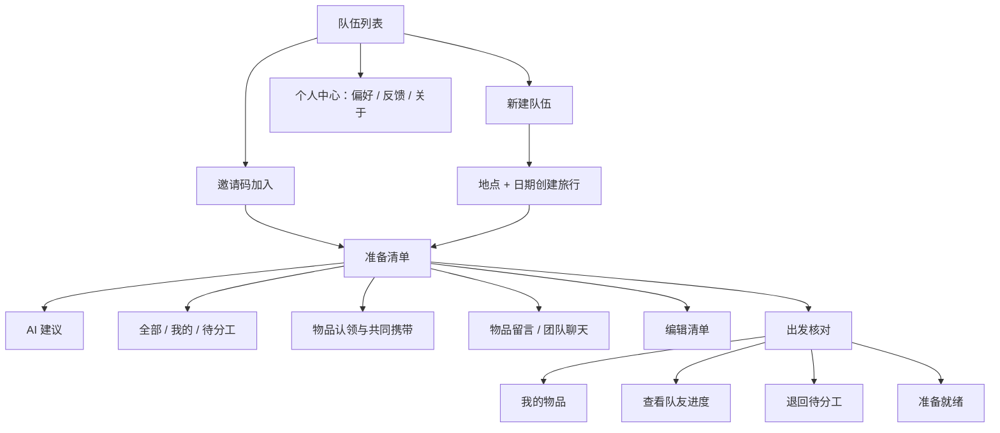
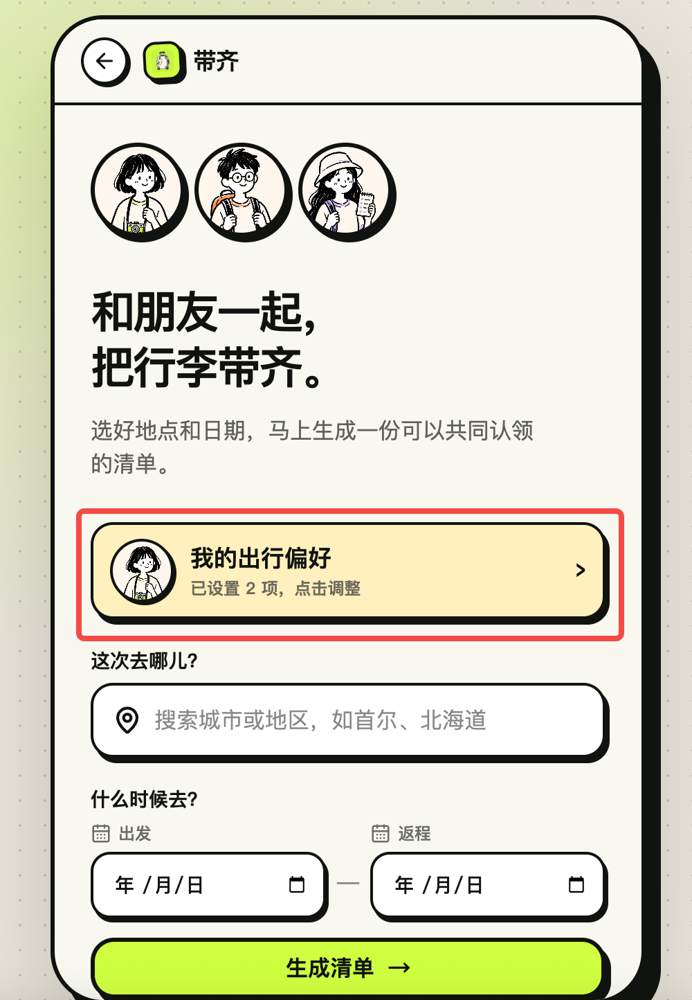
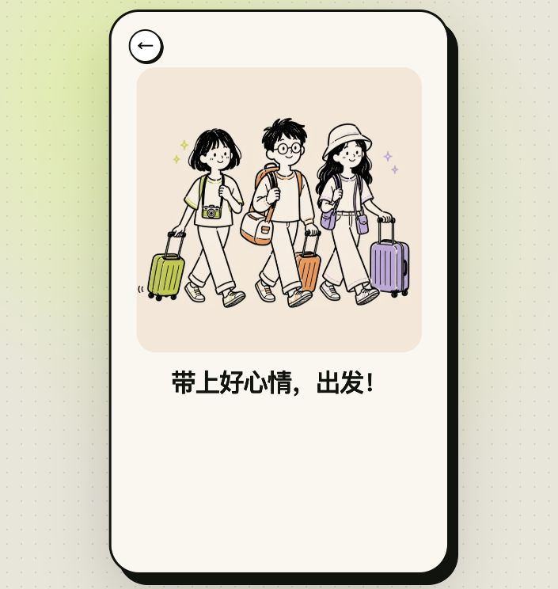

# 带齐：AI 旅行物品协作助手｜产品案例

## 1. 项目摘要

| 项目项 | 内容 |
|---|---|
| 产品名称 | 带齐 DaiQi |
| 一句话定位 | 让 2–4 位朋友一起完成旅行物品分工与出发前核对 |
| 核心用户 | 结伴短途旅行、出境游、演唱会或活动出行的朋友小队 |
| 核心场景 | 建队后共同准备，出发前各自核对 |
| 产品边界 | 不做路线、景点和餐厅攻略，专注“带什么、谁来带、带齐了吗” |
| Demo 场景 | 3 人前往韩国首尔 5 天 |
| 当前阶段 | 可安装的多人协作 MVP + 2 个真实 AI 服务接口 |

## 2. 问题发现

最初的灵感来自朋友共同编辑的旅行物品表格。结伴出行并不是几个人各写一份互不相关的个人清单：相机、三脚架、吹风机和部分洗护用品可以协作携带，从而在保留必要冗余的前提下减少重复物品与无效负重。目标也不是强制每件东西只能由一个人带，而是让团队明确哪些可以共享、哪些需要多人携带，更合理地分配整体负重。

这使“收拾行李”变成了一个小型协作任务。团队不仅要想起物品，还要持续回答：这件东西是否需要、由谁负责、是否有人也会带、分工变化后所有人是否知道。

### 用户的真实任务

用户并不是想“管理一张表”，而是连续完成四件事：

1. 想起该带哪些东西。
2. 判断哪些物品可以共用，并确定由谁负责。
3. 在讨论变化后及时更新分工。
4. 临出发时确认自己的物品已经装包。

### 现有方式的断点

- **共享表格**：信息密度高，但手机端横向查看、编辑和核对成本高。
- **群聊**：适合自然讨论，但消息会沉底，“我带”“你带”“我可能带不了”难以沉淀为最新、可靠的状态。
- **个人清单 App**：缺少多人认领和共同讨论。
- **旅游攻略产品**：重心是去哪儿，不是出发前的执行协作。

信息断点也会放大关系摩擦：两个人都以为转换插头由对方携带，最后无人携带；或一方说“相机我应该能带”，另一方把它理解成已确认，临时变化后便容易出现“不是说好你带吗”。这类争执通常不是成员不负责，而是对话没有变成双方确认、所有人可见的共同状态。

因此，产品机会不是做一张更漂亮的表格，而是把自然交流与结构化分工连接起来，让物品、负责人、变更记录和个人核对共享同一数据源。

## 3. 产品原则

### 原则一：准备和核对分开

准备阶段需要全局视角，出发前只需要个人行动视角。产品用两个阶段承载不同任务，避免把认领、聊天、提醒和打勾都堆进一张页面。

### 原则二：AI 做补充和结构化，不替用户做最终决定

- 推荐物品时，AI 只给少量、具体、未包含的清单缺口。
- 识别分工时，AI 先生成确认卡，用户确认后才修改清单。

### 原则三：清单是唯一事实来源

无论操作来自按钮、编辑模式还是聊天识别，最终都写回同一份物品与分工数据。不同筛选视图只是同一数据源的不同切片。

### 原则四：默认简单，复杂能力按需出现

- 常态只显示物品、成员头像和一个主操作。
- 删除和排序集中在编辑模式。
- 留言点击物品名称后展开，并按时间顺序保留。
- 出发核对页取消聊天，只保留勾选和“我不带了”。

## 4. 信息架构

## 5. 核心功能

### 5.1 创建队伍

登录后的首屏是队伍列表：首次进入显示空状态，用户可新建队伍或输入 6 位邀请码加入朋友的队伍；右上角个人头像进入“出行偏好 / 意见反馈 / 关于带齐”。队伍列表支持管理模式，只有进入管理后才显示删除操作，降低误触。

新建队伍时，用户从地点搜索组件选择城市或地区，也可以在无搜索结果时直接使用输入内容作为兜底；补充出发、返程日期后，系统生成旅行队伍和基础物品清单。成员角色使用一致的卡通头像，进入队伍后右上角展示全队头像，正在查看当前队伍的成员显示在线绿点。

### 5.2 AI 目的地清单补充

系统在用户点击生成清单后，于后台组合标准目的地、日期、天气、个人偏好和当前物品名称调用 AI；服务端完成境内外规则过滤、同义词归一化与清单去重后，最多展示 2 个缺口，并给出一行具体理由。用户主动点击后才加入清单。

设计上的关键不是“AI 能生成多少”，而是控制信息量：

- 每次最多 2 条；
- 必须排除已有物品和近义重复；
- 必须落入现有物品类别之一；
- 不提供景点与路线建议；
- 没有可靠缺口时展示“基础清单已覆盖主要需求”，不留下空白区域。

### 5.3 多人认领

- 无人负责：显示“我来带”。
- 已有人负责：显示成员头像，其他人仍可选“我也带”。
- 自己已选择：按钮变为勾选状态，再次点击可取消。
- 多人共同携带：头像并排显示、不相互覆盖，保留每个人独立的携带状态。
- 每人自备：证件、衣物、牙刷、毛巾等默认归入每个人的个人清单，其他成员仍可看到。

### 5.4 筛选与编辑

- **全部**：查看完整清单。
- **我的**：先展示我认领的团队物品，再展示每人自备物品。
- **待分工**：只展示尚未有人负责的团队物品。
- **编辑**：在当前筛选结果中删除或拖动排序，不会强制跳回“全部”。删除作用于底层统一清单，因此其他视图同步变化。

筛选与编辑工具栏在滚动时固定在顶部，减少返回页面顶部的成本。

### 5.5 物品留言与 AI 分工确认

协作沟通被拆成两个清楚的场景：点击物品名称或图标打开带独立阴影的居中“物品留言”弹窗，每条留言都展示发送人和时间，内容天然绑定物品，不依赖 AI 识别；底部“团队聊天”用于自由交流，当其中出现“你来带转换插头”，且被指派者回复“好”时，系统立即在回复下方展示分工确认卡。留言弹窗下方使用独立圆形按钮，提供删除、当前状态对应的“我来带 / 我不带”和关闭操作。

### 5.6 出发核对

核对页只展示“个人自备物品 + 我已认领的团队物品”。用户只能修改自己的勾选状态，可以一键全选；查看朋友清单时只能查看或提醒，不能替朋友完成。

如果临出发发现某件团队物品带不了，可以点击“我不带了”，将它退回前一阶段的待分工池。

### 5.7 完成状态

完成页不再重复数量、队伍和状态信息，只保留一个轻松明确的结束反馈。

## 6. 两个 AI 功能为何成立

### AI 功能一：从目的地推断“容易漏带的清单缺口”

它解决的是清单冷启动与遗漏焦虑，不是泛化攻略。系统同时把已有清单传给模型，让 AI 做差异补充，而不是重新生成一份长清单。

### AI 功能二：从对话推断“潜在分工动作”

它解决的是群聊与清单割裂。模型不是简单总结聊天，而是把自然语言映射为可执行的结构：物品、发起人、被指派人、意图、置信度和待确认动作。

两项 AI 能力都遵循同一原则：**模型建议，用户确认，结构化数据落库。**

## 7. 关键产品亮点（面试表达）

### 亮点 1：从表格形态退回用户任务

项目没有把共享表格机械搬到手机上，而是识别出“准备”和“核对”是两个不同阶段，重新设计移动端的信息结构。

### 亮点 2：AI 不是聊天入口，而是嵌入业务动作

AI 推荐直接关联“加入清单”，AI 对话理解直接关联“确认分工”。每次 AI 输出都有明确的下一步和可衡量结果。

### 亮点 3：Human-in-the-loop 降低协作误伤

多人清单属于共享事实，错误修改会影响所有人。因此他人指派、模糊表达和模型推断都不直接落库，而是先征求被指派者确认。

### 亮点 4：统一数据源支持多视图一致性

全部、我的、待分工和出发核对并不是四份清单，而是基于物品、分工和核对状态计算出的视图。这保证删除、认领和退回操作能同步反映到其他页面。

### 亮点 5：克制的信息密度

推荐最多 2 条、编辑能力进入模式后出现、聊天按物品展开、完成页只保留情绪反馈。产品持续围绕“简单、上手快”做减法。

## 8. 成功指标

### 北极星指标

**出发前 24 小时，已明确负责人或已标记个人自备的有效物品占比。**

### 核心漏斗

1. 创建队伍成功率。
2. 邀请成员加入率。
3. 首次认领完成率与用时。
4. AI 推荐加入率。
5. AI 分工建议确认率。
6. 出发前核对完成率。

### AI 质量指标

- 推荐重复率、推荐采纳率、推荐后删除率。
- 对话分工识别准确率、误触发率、确认拒绝率。
- 物品实体匹配准确率和低置信度澄清率。

## 9. 当前工程落地与下一阶段

### 已完成：从 Demo 到可用 MVP

- D1 已建立用户、资料、旅行、成员、物品、认领、留言、聊天、分工候选、快照和事件 11 张表。
- 已接入托管账号身份、6 位邀请码、2–4 人限制和服务端成员权限校验。
- 认领、删除、排序、留言、聊天和核对均由服务端保存；同一运行实例内通过 SSE 立即通知客户端刷新，2.5 秒版本轮询负责断线重连与跨实例兜底。
- 目的地补漏与聊天分工识别都在服务端调用 DeepSeek；模型异常时有规则回退。

### P1：提高准备效率

- 目的地、季节、天数与活动偏好共同驱动 AI 推荐。
- 按清单变化重新计算推荐缺口。
- 支持系统通知和“请求朋友携带”提醒。

### P2：形成长期价值

- 复用历史旅行模板。
- 根据用户已有设备和偏好生成个性化预设清单，新增物品保持待分工。
- 旅行结束后生成可复用的团队清单。
